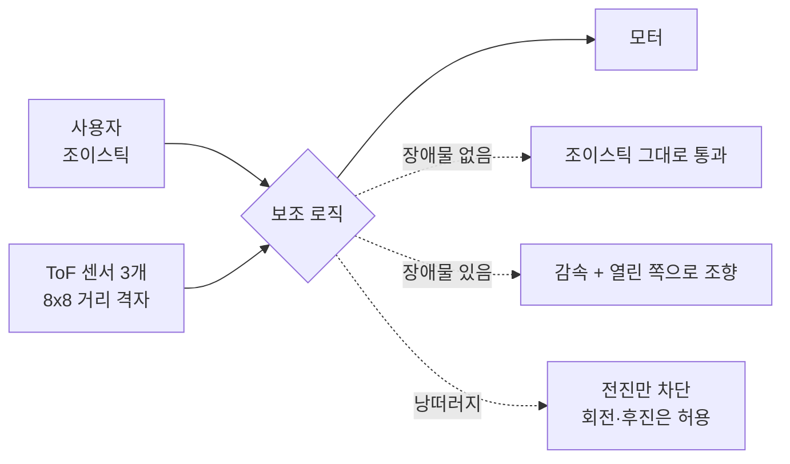
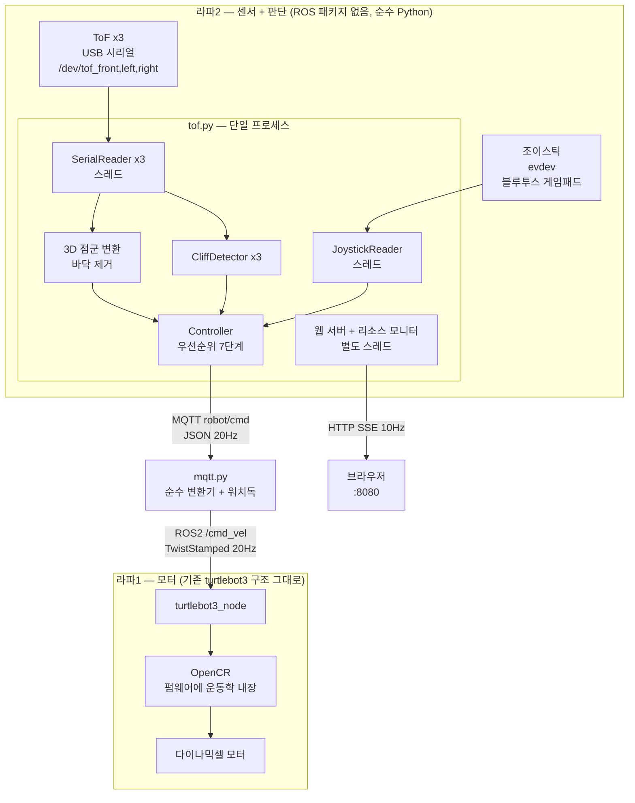
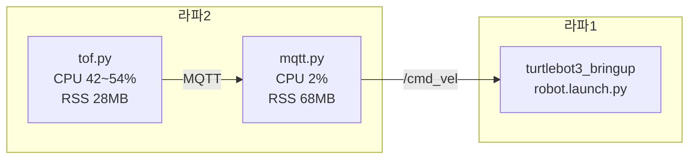
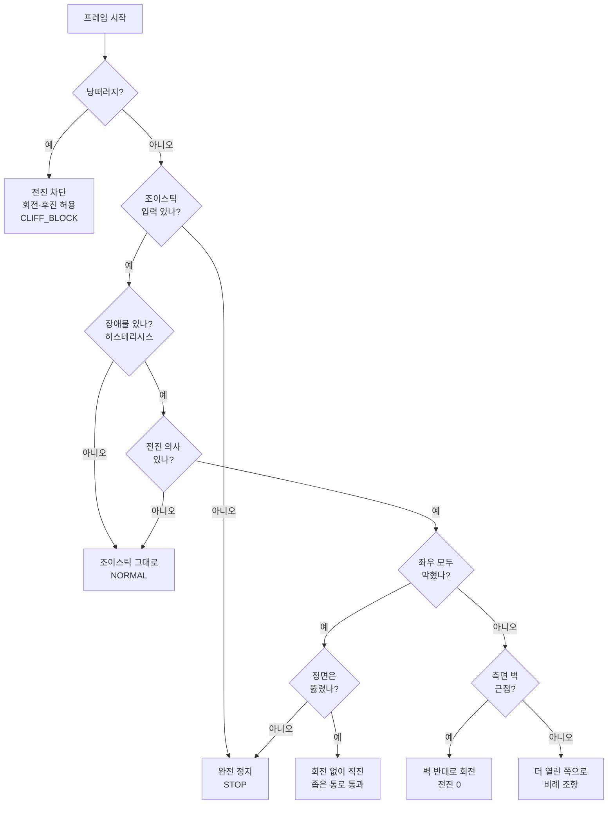
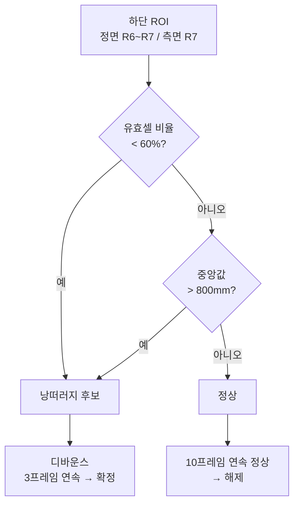
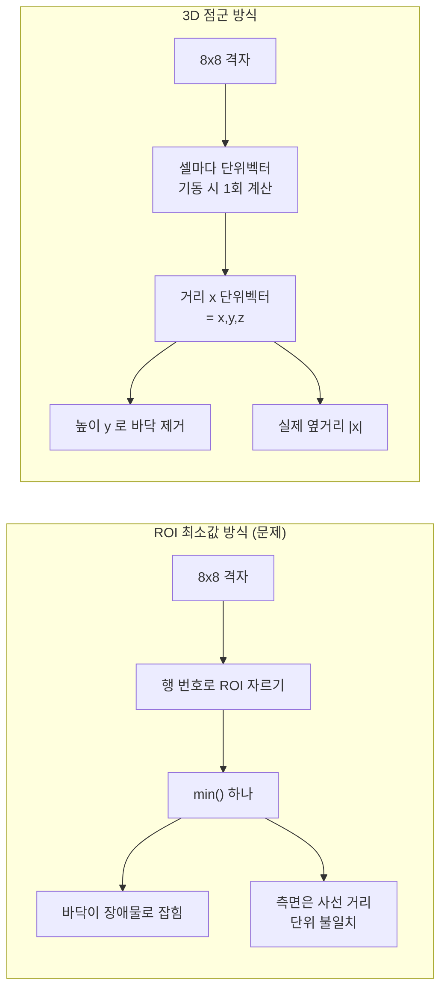
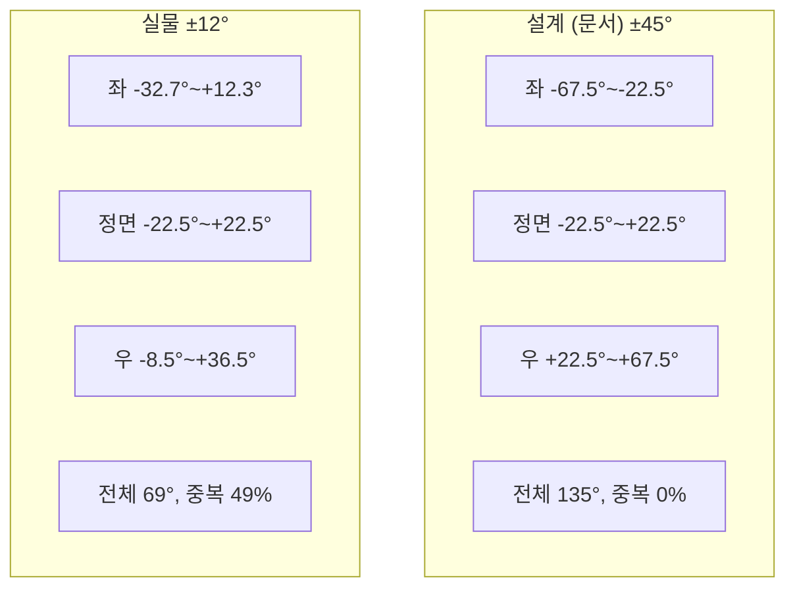
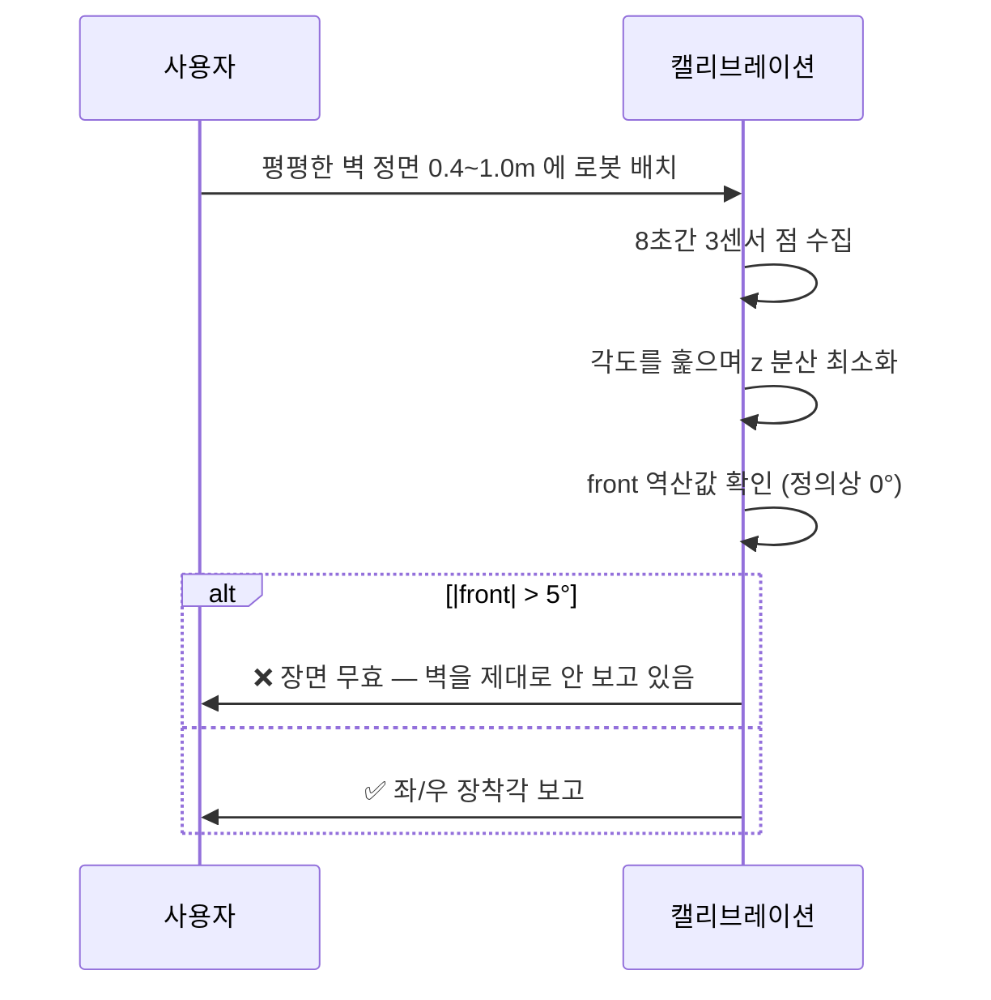
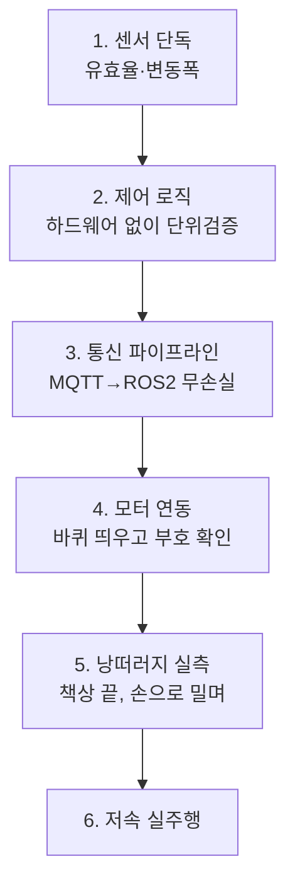

# ToF 3개 기반 주행보조(ADAS) 시스템 — 구축 가이드

> TurtleBot3 Waffle + VL53L8CX ToF 8×8 센서 3개로 만든 **조이스틱 주행보조** 시스템.
> 장애물 회피와 낭떠러지 감지를 하되, **조작 권한은 항상 사람에게 남긴다.**
>
> 이 문서는 같은 시스템을 처음부터 다시 만들 때 참고하도록 쓴 것이다.
> 결론뿐 아니라 **왜 그렇게 했는지**와 **어디서 틀렸는지**를 같이 적었다.
> 검증 이력·실패 기록은 [STATUS.md](STATUS.md) 참조.

---

## 목차

1. [무엇을 만드는가](#1-무엇을-만드는가)
2. [시스템 구조](#2-시스템-구조)
3. [하드웨어](#3-하드웨어)
4. [핵심 설계 결정 6가지](#4-핵심-설계-결정-6가지)
5. [장애물 회피 알고리즘](#5-장애물-회피-알고리즘)
6. [낭떠러지 감지 알고리즘](#6-낭떠러지-감지-알고리즘)
7. [ToF 기하 — 8×8을 3D로 펴기](#7-tof-기하--88을-3d로-펴기)
8. [센서 장착과 캘리브레이션](#8-센서-장착과-캘리브레이션)
9. [검증 방법론](#9-검증-방법론)
10. [함정 모음](#10-함정-모음--같은-실수-반복하지-않기)
11. [실측 데이터](#11-실측-데이터)
12. [미해결 과제](#12-미해결-과제)
13. [파라미터 표](#13-파라미터-표)
14. [실행 절차](#14-실행-절차)

---

## 1. 무엇을 만드는가

전동 휠체어·이동 로봇의 **운전자 보조**다. 자율주행이 아니다.



**설계 철학 — 사람이 최종 결정권을 갖는다**

| 원칙 | 구현 |
|---|---|
| 손 떼면 즉시 정지 | 조이스틱 입력 없으면 무조건 출력 0 |
| 로봇이 스스로 후진하지 않는다 | `linear_x = min(사용자_전진, v_avoid)` — 구조적으로 음수 불가 |
| 전진 의사가 있을 때만 회피 개입 | 제자리 회전·후진 중에는 회피 로직이 안 걸린다 |
| 낭떠러지에서도 탈출 경로를 막지 않는다 | 전진만 0, 회전·후진은 그대로 통과 |

마지막 항목이 한 줄로 성립한다:

```python
if cliff_detected:
    return min(manual_linear, 0.0), manual_angular   # 전진→0, 후진→통과, 회전→그대로
```

---

## 2. 시스템 구조

### 2.1 전체 흐름

라즈베리파이 2대로 나눈다. **센서·판단**과 **모터 구동**을 분리하는 게 요점이다.



**왜 이렇게 나눴나**

- **판단을 한 프로세스에 모은다.** 안전 규칙이 여러 파일에 흩어지면 우선순위가 깨진다. 낭떠러지 차단이 다른 노드에 의해 우회될 여지를 없앤다.
- **라파2에 ROS 패키지를 만들지 않는다.** 순수 Python 스크립트 2개. 빌드·소싱 없이 바로 고쳐 돌린다. 실험 속도가 크게 달라진다.
- **mqtt.py는 판단하지 않는다.** 받은 값을 그대로 `TwistStamped`로 옮기는 변환기다. 유일한 예외가 워치독(0.5초 무수신 → 정지 발행)인데, 이건 판단이 아니라 통신 장애 시 안전 정지다.
- **라파1은 손대지 않는다.** 표준 turtlebot3 bringup만 돌린다. 벤더 스택을 건드리지 않으면 문제 격리가 쉽다.

### 2.2 프로세스 구성



라파5(4코어) 기준 둘 합쳐 **약 13%**. 여유는 충분하다.
tof.py CPU의 대부분은 ToF 3채널 시리얼 파싱이고, 제어 연산 자체는 미미하다.

---

## 3. 하드웨어

| 항목 | 사양 | 비고 |
|---|---|---|
| 로봇 | TurtleBot3 **Waffle** | 축간거리 287mm, 바퀴 반지름 33mm |
| 라파1 | Raspberry Pi, Ubuntu 24.04, ROS2 Jazzy | OpenCR 연결 |
| 라파2 | Raspberry Pi 5, Ubuntu 24.04 | ToF·조이스틱 연결, ROS2는 mqtt.py만 사용 |
| ToF | VL53L8CX 8×8, FoV 45°×45° | Pico 2 경유 USB 시리얼 115200 |
| 조이스틱 | 블루투스 게임패드 | 라파2에 페어링 |

**ToF 3개 배치**: 정면 1개 + 좌우 각 1개. 좌우 장착각은 §8 참조 — **문서만 믿지 말고 반드시 실측할 것.**

**udev 규칙**으로 고정 심볼릭 링크를 만든다. USB 순서는 부팅마다 바뀐다.

```
/dev/tof_front, /dev/tof_left, /dev/tof_right
```

어느 장치가 어느 방향인지는 손을 흔들어 값이 떨어지는 걸 보고 판별한다.

---

## 4. 핵심 설계 결정 6가지

| # | 결정 | 이유 |
|---|---|---|
| 1 | 판단을 라파2 단일 프로세스에 집중 | 안전 규칙 우회 방지, 우선순위 명확화 |
| 2 | MQTT(파이썬↔파이썬) + ROS2(모터만) | 라파2에 ROS 의존성을 안 들인다. 디버깅이 쉽다 |
| 3 | `TwistStamped` 사용 | ROS2 Jazzy `turtlebot3_node`가 이것을 구독. plain `Twist`는 **조용히 실패** |
| 4 | 8×8 격자를 3D 점군으로 변환 | 바닥을 **높이 기준**으로 제거. 행 번호로 자르면 장착각이 바뀔 때 무너진다 |
| 5 | 낭떠러지는 **유효셀 비율**이 주 판정 | 낭떠러지에서는 빔이 허공으로 나가 셀이 무효가 된다. 거리는 잘 안 오른다 |
| 6 | 웹 화면을 제어 프로세스에 내장 | 시리얼은 한 프로세스만 열 수 있다. 단 **제어 루프와는 스레드로 분리** |

---

## 5. 장애물 회피 알고리즘

VFH가 아니다. **결정론적 임계값 상태기계 + 히스테리시스 + 비례 조향**이다.
확률·히스토그램·비용함수가 없다. 그래서 동작을 예측·설명할 수 있다.

### 5.1 판단 우선순위

위에서부터 검사하고, 먼저 걸리면 확정한다.



**각 분기의 의도**

- **① 낭떠러지 최우선** — 다른 어떤 판단보다 앞선다.
- **② 무입력 정지** — 데드맨 스위치. 손을 떼면 어떤 상태에서도 멈춘다.
- **④ 전진 의사 없으면 통과** — 제자리 회전이나 후진으로 빠져나가려는 걸 회피 로직이 방해하면 안 된다.
- **⑤ 좁은 통로** — 좌우가 다 막혔는데 정면이 뚫렸으면 문틀이다. 멈추지 말고 직진해야 통과한다. 이게 없으면 문 앞에서 굳는다.
- **⑦ 비례 조향** — on/off가 아니라 가까울수록 세게 꺾고 느리게 간다.

### 5.2 히스테리시스 (필수)

단일 임계값을 쓰면 경계에서 회피가 깜빡인다. 진입과 해제 임계를 분리한다.

```
진입: front <= 0.50m  →  회피 시작
해제: front >  0.65m  →  회피 종료
그 사이(0.50~0.65m)  →  이전 상태 유지
```

> **함정**: 해제 임계값이 **실제로 도달 가능한지** 확인해야 한다.
> 우리는 바닥 반사가 정면 거리를 0.62m에 묶어서 해제 임계 0.65m에 **영원히 도달하지 못했다.**
> 한 번 회피에 걸리면 장애물을 치워도 안 풀렸다. §10-④ 참조.

### 5.3 비례 조향 수식

```python
t = clamp((enter - front) / (enter - front_stop), 0, 1)   # 0=막 감지, 1=거의 충돌
w = w_min + (w_avoid - w_min) * t                          # 가까울수록 세게 꺾음
v = min(user_forward, v_avoid) * (1 - t)                   # 가까울수록 느리게
```

`front_stop`(0.20m)에서 `v ≈ 0`, `w = w_avoid`가 된다. 즉 **거의 제자리 회전**.

방향은 좌우 중 **더 열린 쪽**으로 정한다(동률이면 좌측 우선).

---

## 6. 낭떠러지 감지 알고리즘

ToF 8×8의 **하단 행이 바닥을 본다**는 점을 이용한다.
기존 프로젝트들이 "바닥이라 쓸모없다"며 버리던 행이다.

### 6.1 두 가지 신호



| 신호 | 의미 | 실측 기여도 |
|---|---|---|
| **유효셀 비율 < 60%** | 빔이 허공으로 나가 반사가 없다 | **감지 6/6 전부 이 경로** |
| 중앙값 > 800mm | 아래 바닥이 사거리 안에 보이는 낮은 단차 | 백스톱 |

> **핵심 발견**: 실주행 감지 6회가 **전부 유효셀 비율**로 잡혔다. 거리 기준은 한 번도 안 걸렸다.
> 낭떠러지에서는 셀이 하나씩 무효가 되는데, **남은 셀은 여전히 바닥을 보므로 중앙값이 잘 안 오른다.**
> 실제로 중앙값 270mm(완전 정상)인 상태에서 감지된 사례가 있다.
> → **거리 임계만으로 낭떠러지를 잡으려 하면 실패한다.**

### 6.2 비대칭 디바운스

```
진입: 3프레임(0.15초) 연속  ← 빠르게
해제: 10프레임(0.5초) 연속  ← 느리게
```

안전 방향으로 비대칭이다. 늦게 감지하는 것보다 늦게 푸는 게 낫다.

### 6.3 적응형 기준선과 그 검증

센서 장착 각도·높이가 로봇마다 달라 절대 임계값을 못 쓴다.
기동 시 20프레임 동안 평지 바닥 거리를 학습한다.

> **함정**: 로봇을 들거나 기울인 채로 켜면 **배경(벽)을 '바닥'으로 학습한다.**
> 그러면 낭떠러지 기능이 통째로 무의미해지는데 **에러가 하나도 안 난다.**
> 실제로 기준선 2402mm(바닥은 300mm)로 학습되고 가짜 낭떠러지까지 래치됐다.

그래서 워밍업 직후 **바닥 형상 검증**을 한다:

```
바닥을 비스듬히 보면 아래 행일수록 거리가 짧아진다  → 단조 감소 + 총 낙차 30mm 이상
벽·배경을 보면 행마다 비슷하거나 들쭉날쭉하다
```

절대 거리로는 장착 높이를 모르니 판정할 수 없다. **모양으로 본다.**
어긋나면 콘솔 경고 + 웹 화면에 빨간 `⚠ 바닥 아님` 표시.

---

## 7. ToF 기하 — 8×8을 3D로 펴기

### 7.1 왜 필요한가

센서마다 ROI 최소값 하나로 줄이면 두 가지가 깨진다.



**문제 1 — 바닥이 장애물이 된다.** 정면 센서의 하단 ROI 행이 바닥을 619mm에서 만나면,
빈 복도에서도 정면 거리가 619mm를 못 넘는다. 회피 진입 임계 500mm까지 여유가 119mm뿐이고,
센서를 2.5°만 더 숙이면 상시 오탐이 된다.

**문제 2 — 측면이 사선 거리다.** 비스듬히 붙은 센서의 raw 값은 "옆으로 얼마나 떨어졌나"가 아니다.
그 값을 옆거리 임계와 비교하는 건 단위가 다른 것끼리 비교하는 것이다.

### 7.2 좌표계와 변환

```
x = 좌우 (오른쪽 +)    y = 높이 (위 +, 원점은 바닥)    z = 전방 (앞 +)
```

셀 (i, j)의 방향은 **고정**이다. 기동 시 한 번만 계산해 두면 매 프레임은 곱셈뿐이다.

```python
phi   = (FoV_h/2) * (j*2 - 7) / 7               # 좌우 각도
theta = (FoV_v/2) * (-i*2 + 7) / 7 + mount_θ    # 상하 각도 (+ 장착 기울기)

# 센서 로컬 (정면 = +z)
lx, ly, lz = sin(phi)cos(theta), sin(theta), cos(phi)cos(theta)

# 좌우 장착각만큼 회전
ux =  lx*cos(mount_φ) + lz*sin(mount_φ)
uy =  ly
uz = -lx*sin(mount_φ) + lz*cos(mount_φ)

# 매 프레임
x, y, z = d*ux, sensor_height + d*uy, d*uz
if y <= floor_margin: continue        # 바닥 제거 — 장착각이 바뀌어도 따라간다
```

### 7.3 유도 지표

| 지표 | 계산 | 용도 |
|---|---|---|
| 정면 거리 | 정면 밴드(±8.5°) 안에서 가까운 3개 z의 평균 | 셀 하나의 최소값보다 노이즈에 강함 |
| 옆거리 | 정면 원뿔 제외한 점들의 min \|x\| | **시야가 넓을 때만 유효** (§8) |
| 섹터 거리 | 좌/우 섹터의 min z | 시야가 좁을 때 대안 |

> **함정**: 옆거리를 잴 때 정면 원뿔을 안 빼면, 바로 앞 장애물이 x 부호만으로
> "옆벽 3.8cm"가 된다. 실제로 겪었다.

---

## 8. 센서 장착과 캘리브레이션

### 8.1 장착각은 반드시 실측한다

**우리 프로젝트 최대의 오판이 여기서 나왔다.** 문서에 "좌우 45°"라고 적혀 있었고,
그걸 믿고 코드를 짰다. 실측해보니 **±10~14°**였다.



**영향**: 센서 3개를 달고 **1.5개어치만 쓰게 된다.** 그리고 좌/우 채널을
"측면 공간"으로 해석하는 로직이 전부 근거를 잃는다 — 둘 다 거의 정면을 본다.

실주행에서 그대로 나타났다: 회피 진입 14회 동안 좌↔우 방향 전환 **47회**(진입당 3.4번).
좌우 거리차 중앙값이 40mm뿐이라 노이즈로 방향이 계속 뒤집힌다.

### 8.2 캘리브레이션 방법 — 평면 벽 역산

평평한 벽을 정면으로 마주보면 **세 센서가 보는 모든 점의 z가 같아야 한다.**
좌우 센서는 비스듬히 보므로 사선 거리는 열마다 다르지만, 장착각이 맞으면
3D 변환 후 z가 한 값으로 모인다. **z의 흩어짐이 최소가 되는 각도가 정답이다.**



**핵심은 자체 검증 게이트다.** front의 좌우 장착각은 **정의상 0°**다(로봇 전방축을
그것으로 정하니까). 역산에서 0이 안 나오면 각도 문제가 아니라 **장면이 잘못된 것**이다.

이 게이트가 없던 첫 버전은 벽을 안 보는 상태에서 "front를 −20.8°로 바꾸세요"라고
**자신 있게 틀린 답**을 내놨다. 그대로 따랐으면 멀쩡한 설정을 망쳤다.

### 8.3 교차 검증 — 최소거리 비

역산 하나만 믿으면 안 된다. 전혀 다른 방법으로 확인한다.

벽을 마주보면 벽에 가장 수직인 광선이 최소 거리를 준다:

```
|장착각| <= FoV반각(22.5°)  →  최소거리 ≈ D          (정면 향한 광선이 있음)
|장착각| >  22.5°           →  최소거리 = D / cos(|장착각| - 22.5°)
```

| 센서 | 최소거리 | front 대비 | ±45°라면 |
|---|---|---|---|
| front | 580mm | 1.000 | — |
| left | 572mm | 0.988 | 1.082 |
| right | 559mm | 0.965 | 1.082 |

두 방법이 독립적으로 일치했고, 육안으로도 확인했다.

### 8.4 상하 장착각 역산

바닥을 보는 두 행의 실측 거리로 장착 높이와 각도를 동시에 푼다.

```
행 i 의 내림각 θ_i,  슬랜트 거리 d_i = h / sin(θ_i)
행 간격 = FoV_v / 8 = 5.625°

d_6 / d_7 = sin(θ_6 + 5.625°) / sin(θ_6)   →  θ_6 풀림  →  h = d_6 · sin(θ_6)
```

실측 결과: 정면 높이 111mm 내림각 21.6°, 좌 105mm 15.1°, 우 102mm 16.2°.
이 값으로 **낭떠러지 감지가 몇 cm 앞을 보는지**도 계산된다(정면 216~281mm 앞).

---

## 9. 검증 방법론

기능마다 "돌아간다"가 아니라 **숫자로** 확인한다. 순서가 중요하다.



### 9.1 단계별 확인 항목

| 단계 | 확인 | 방법 |
|---|---|---|
| 1 | ToF 유효율 100%, 변동폭 10mm 이내 | 정지 상태 250프레임 통계 |
| 2 | 안전 불변식 | 하드웨어 없이 `Controller.step()` 단위 호출 |
| 3 | 값 무손실 | MQTT와 `/cmd_vel`을 **동시 구독**해 값 집합 비교 |
| 4 | **부호 규약** | 바퀴 띄우고 `/cmd_vel` 직접 발행 → 엔코더 적분 |
| 5 | 감지 여유 | 감지 순간 정지 → 모서리까지 자로 측정 |
| 6 | 실주행 | 로그에서 규칙별 성립 횟수 집계 |

### 9.2 검증 설계에서 배운 것

**① 변수를 하나만 두어라.** 4단계에서 조이스틱을 쓰지 않고 `/cmd_vel`을 직접 발행했다.
조이스틱을 끼면 부호 문제인지 입력 문제인지 구분이 안 된다.

**② 보고값을 믿지 말고 물리량을 재라.** `joint_states.velocity`가 이상해서 **엔코더 위치를
적분**했더니 회전이 명령의 56%였다. 보고값만 봤으면 못 잡았다.

**③ 원인을 가리는 결정적 실험을 설계하라.** 운동학 변환이 라파이에서 되는지 펌웨어에서
되는지 몰랐을 때, **파라미터를 2배로 바꿔봤다.** 동작이 안 변해서 펌웨어라고 확정했다.

**④ 음성 대조군을 확인하라.** 캘리브레이션 도구는 **벽을 안 보는 상태에서 결과를
거부해야** 신뢰할 수 있다. 그걸 확인하고 나서야 결과를 믿었다.

**⑤ 시각 대조는 샘플링 어긋남을 만든다.** HTTP 폴링과 ROS 수신 시각이 달라 큰 오차가
나왔다. 시각이 아니라 **값의 순서열**로 비교해야 한다.

---

## 10. 함정 모음 — 같은 실수 반복하지 않기

가장 값비싼 부분이다. 전부 실제로 겪었다.

### ① `Twist` vs `TwistStamped`

ROS2 Jazzy `turtlebot3_node`는 `TwistStamped`를 구독한다.
plain `Twist`를 발행하면 **에러 없이 조용히 실패**한다. 모터가 안 움직이는데 로그는 깨끗하다.

### ② OpenCR 펌웨어에 운동학이 박혀 있다

TurtleBot3는 **모델별 펌웨어**를 OpenCR에 굽는다.
`TURTLEBOT3_MODEL` 환경변수와 `.yaml` 파라미터를 waffle로 맞춰도,
**펌웨어가 burger면 실제 거동은 burger다.**

우리는 회전이 명령의 **56%**로 나왔다(축간거리 0.160 vs 0.287).
`ros2 param get wheels.separation`은 0.287을 반환했는데 실제는 0.160이었다.
ROS 파라미터는 **오도메트리 계산에만** 쓰인다.

```bash
# 확인: 파라미터를 2배로 바꿔도 바퀴 속도가 안 변하면 펌웨어 쪽이다
ros2 param set /turtlebot3_node wheels.separation 0.574
# 해결
cd ~/opencr_update && ./update.sh /dev/ttyACM0 waffle.opencr
```

### ③ evdev는 값이 변할 때만 이벤트를 낸다

조이스틱 타임아웃을 **마지막 축 이벤트 시각**으로 재면 안 된다.
스틱을 한 방향으로 고정하면 **아무 이벤트도 안 온다**(실측: 12초 동안 0개).
0.3초 뒤 "입력 없음"으로 판정되어 로봇이 멈추고, 흔들어야 다시 움직인다.

**해결**: `select`로 돌면서 이벤트가 없어도 **장치가 살아있으면** 하트비트로
타임스탬프를 갱신한다. 타임아웃의 의미가 "입력이 없다"에서
**"장치가 사라졌다"**로 바뀐다 — 원래 의도한 것.

### ④ 해제 임계값이 도달 불가능할 수 있다

바닥 반사가 정면 거리를 0.62m에 묶는데 해제 임계가 0.65m면,
**한 번 회피에 걸리면 영원히 안 풀린다.** 장애물을 치워도 계속 회전값을 얹는다.

히스테리시스를 넣을 때 **해제 조건이 실제로 성립 가능한지** 반드시 확인할 것.

### ⑤ 워밍업 학습은 자기 자신을 검증해야 한다

적응형 기준선은 편리하지만, **잘못된 상태에서 학습해도 아무 에러가 안 난다.**
학습 직후 "학습한 게 물리적으로 말이 되는가"를 검사하라. §6.3의 형상 검증.

### ⑥ `pkill -f`는 자기 셸을 죽인다

`pkill -f 'python3 tof.py'`는 그 문자열을 명령줄에 포함한 **자기 자신의 셸**도 죽인다.
SSH 세션이 끊기고 원인을 못 찾는다. 패턴을 `'^python3 tof\.py'`로 고정하거나 PID를 쓸 것.
같은 이유로 프로세스 탐색도 `cmdline` 부분일치로 하면 셸 래퍼를 오탐한다.

### ⑦ 중복 발행자

이전 프로세스가 남아 있으면 `/cmd_vel`이 **2중 발행**되어 40Hz로 뛰고 명령이 섞인다.
실행 전 `ros2 topic info /cmd_vel`로 **Publisher가 1개인지** 확인할 것.

### ⑦-2 좌/우 지표에 정면 성분이 섞이면 부호가 반대로 나온다

"어느 쪽이 더 열렸나"를 재려고 좌/우 반평면의 최소거리를 쓰면,
**정면 장애물이 어느 쪽 반평면에 들어가느냐**로 값이 결정된다.

- 장애물이 중앙에서 조금 왼쪽 → 좌측 값이 작아짐 → "왼쪽이 막혔다" → **막힌 쪽으로 조향**
- 정확히 중앙 → 프레임마다 좌우가 뒤집힘 → **제자리에서 떨림**

우리는 이 때문에 회피가 **4번에 1번만** 성공했다.
**정면 원뿔을 제외**(불감대)해야 좌우가 비로소 "측면 개방도"를 재게 된다.

그리고 좌우 차이가 작을 때는 노이즈로 방향이 뒤집히므로 **방향 커밋**이 필요하다 —
한 번 정하면 반대쪽이 일정 마진 이상 더 열려야 바꾼다.
(실측: 마진 0이면 200프레임 중 112회 전환, 마진 0.12m면 0회)

### ⑧ 고장을 정상으로 보이게 하지 마라

가장 위험한 버그 유형이다. 우리가 겪은 것:

| 증상 | 왜 위험한가 |
|---|---|
| 미연결 센서를 `0.00m`로 보고 | 실제 근접과 구분 불가 |
| 프로세스가 죽어도 화면에 옛 값 유지 | 실시간으로 오인 |
| 죽은 프로세스를 "실행 중"으로 표시 | 통신 두절을 못 알아챔 |

**값이 틀린 것보다 틀렸다는 걸 숨기는 게 나쁘다.**
갱신이 끊기면 화면을 흐리게 하고, 무효는 `null`로 보고하고,
"측정값 없음"과 "물체 없음"과 "센서 고장"을 **다른 상태로** 구분하라.

### ⑨ 문서를 믿지 마라

장착각 45°는 설계 문서에 있었고 실물은 12°였다.
**기하에 의존하는 값은 전부 실측하라.** 캘리브레이션 도구를 만드는 게 결국 빠르다.

---

## 11. 실측 데이터

라파5 4코어 / 8GB, TurtleBot3 Waffle 기준.

### 11.1 통신·자원

| 항목 | 실측 |
|---|---|
| MQTT `robot/cmd` | 19.96 Hz, 간격 평균 50.1ms, **유실 0/199** |
| ROS2 `/cmd_vel` | **20.000 Hz**, std dev 0.19ms |
| 메시지 크기 | 373 B → 7.3 KB/s |
| tof.py | CPU 42~54%(4코어 중 11~13%), RSS 28MB, 8스레드 |
| mqtt.py | CPU 2%, RSS 68MB, 16스레드 |
| 브라우저 2개 접속 시 | CPU +14%p, **제어 루프 20.0Hz 유지** |

### 11.2 센서

| 항목 | 실측 |
|---|---|
| ToF 유효율 | 100% (평지, 하단 ROI) |
| 거리 변동폭 | 9~12mm (30초/119샘플) |
| 평지 바닥 거리 | 270~340mm |
| 낭떠러지 임계 여유 | 2.4~3.0배 |
| 평지 오탐 | **0건** (251초) |

### 11.3 낭떠러지 감지 여유

감지 순간 **로봇 앞면에서 모서리까지 12cm**(손으로 천천히 밀어 측정).

| 주행 속도 | 디바운스 | 파이프라인 지연 | 제동 후 최종 여유 |
|---|---|---|---|
| 0.05 m/s | 8mm | 6mm | **104~106mm** |
| 0.10 m/s | 15mm | 11mm | **84~89mm** |
| 0.15 m/s | 22mm | 17mm | 58~70mm |
| 0.20 m/s | 30mm | 22mm | **28~48mm** ⚠ |

> 최고 속도에서 여유가 3~5cm뿐이다. **첫 실주행은 속도를 절반으로 낮출 것.**

### 11.4 실주행 (1001샘플)

| 검사 | 결과 |
|---|---|
| 낭떠러지 중 전진 차단 | 12/12 ✅ |
| 낭떠러지 중 회전 통과 | 10/10 ✅ |
| 자율 후진 발생 | 0건 ✅ |
| NORMAL 시 조이스틱 그대로 | 43/43 ✅ |
| 회피 → NORMAL 복귀 | 10회 ✅ |
| 회피 방향이 더 열린 쪽 | 47/53 ⚠ |

---

## 12. 미해결 과제

### ① 가구 밑 빈공간을 낭떠러지로 오탐 (최우선)

의자 다리 옆에서 로봇이 전진하지 못했다.
낭떠러지 감지 128샘플 중 **84건이 "전방 0.8m 안에 물체가 있는데 낭떠러지"**였다.
`F 0.31m`인데 `cliff` 가 뜬 사례도 있다.

**추정 원인**: 가구 다리가 그 뒤 바닥으로 가는 빔을 가려 **그림자**를 만들고,
그 셀들이 무응답이 되어 "바닥 없음"으로 판정된다.

**왜 치명적인가**: 휠체어의 주 사용 환경이 **책상·의자·침대가 있는 실내**다.

**고칠 방향**: 같은 방향에 가까운 장애물이 있으면 낭떠러지 판정을 억제한다.
앞에 물체가 가까우면 장애물 회피가 이미 로봇을 세우므로,
낭떠러지 차단을 더하는 건 안전을 보태는 게 아니라 **탈출을 막는 것**이다.
단 "낮은 턱 너머가 진짜 낭떠러지"인 경우를 위해 억제 조건을 제한해야 한다.

> 추측으로 안전 로직을 고치지 말 것. **낭떠러지 트리거 시 8×8 원본을 덤프**하는
> 진단부터 넣고 재현해서 셀 패턴을 확인한 뒤 고칠 것.

### ② 센서 재장착 (±12° → ±45°)

시야 69° → 135°, 중복 49% → 0%. 좌우 분별력 회복.

### ③ 조향 스무딩

이동평균 + EMA + 직전 방향 commit. 승차감 문제라 우선순위는 낮다.

### ④ 후방 낭떠러지 미보호

센서가 전방 3개뿐이라 후진 중 추락은 막지 못한다.

### ⑤ `turtlebot3_node` 크래시

OpenCR 통신이 끊기면 `stack smashing detected`로 죽는다(벤더 코드 버그).
라파2의 리소스 모니터는 이걸 못 잡는다. 감시가 필요하다.

---

## 13. 파라미터 표

### 장애물 회피

| 파라미터 | 값 | 설명 |
|---|---|---|
| `front_enter_threshold` | 0.50 m | 회피 진입 |
| `front_exit_threshold` | 0.65 m | 회피 해제 (**도달 가능한지 확인 필수**) |
| `front_stop_distance` | 0.20 m | 정면 완전 막힘 |
| `side_min_distance` | 0.15 m | 측면 근접 |
| `v_avoid` | 0.10 m/s | 회피 중 최대 전진 |
| `w_avoid` / `w_min` | 0.6 / 0.15 rad/s | 최대/최소 회전 |

### 낭떠러지

| 파라미터 | 값 | 설명 |
|---|---|---|
| `cliff_roi_rows` | 정면 [6,7] / 측면 [7,7] | 측면은 R6이 바닥을 벗어남 |
| `cliff_abs_mm` | 800 | 절대 거리 임계 (백스톱) |
| `cliff_min_valid_ratio` | 0.6 | **주 판정 경로** |
| `cliff_on_frames` / `off_frames` | 3 / 10 | 비대칭 디바운스 |
| `cliff_warmup_frames` | 20 | 기준선 학습 |

### 3D 기하

| 파라미터 | 값 | 설명 |
|---|---|---|
| `mount_phi_*` | 실측값 | **문서 믿지 말 것** |
| `mount_theta_*` | 실측값 | 하단 2행 거리로 역산 |
| `sensor_height_*` | 실측값 | 같이 역산됨 |
| `floor_margin_mm` | 45 | 이 높이 이하는 바닥 |
| `front_band_half_deg` | 8.5 | 정면 거리 밴드 |

### 안전 클램프

| 파라미터 | 값 |
|---|---|
| `v_max` / `v_min` | 0.22 / −0.15 m/s |
| `w_max` | 1.5 rad/s |
| `joy_timeout` | 0.5 s (**장치 소실** 기준) |
| `watchdog_timeout` | 0.5 s (mqtt.py) |

---

## 14. 실행 절차

### 사전 조건

```bash
# 라파2
sudo apt install mosquitto mosquitto-clients python3-paho-mqtt python3-evdev
sudo systemctl enable --now mosquitto
# udev 규칙으로 /dev/tof_{front,left,right} 생성
# 양쪽 라파에 export ROS_DOMAIN_ID=<같은 값>
```

### 기동 (라파1 먼저)

```bash
# 라파1
export TURTLEBOT3_MODEL=waffle
ros2 launch turtlebot3_bringup robot.launch.py     # "diff_drive_controller: Run!" 확인

# 라파2 — 터미널 2
python3 tof.py          # 평지에 내려놓고 손 뗀 뒤 실행

# 라파2 — 터미널 3
source /opt/ros/jazzy/setup.bash
python3 mqtt.py
```

**기동 로그 확인 항목**

```
[front] 낭떠러지 기준선 학습 완료: 280mm 근처    ← 3채널 다, 평지 바닥 범위
(⚠ 경고 없음)
```

### 확인

```bash
ros2 topic hz /cmd_vel        # 20Hz
ros2 topic info /cmd_vel      # Publisher 1 / Subscription 1
```

웹 화면에서 파란 막대(조이스틱)와 초록 막대(출력) 차이 = 회피 개입량.

### 안 움직일 때

| # | 확인 |
|---|---|
| 1 | 라파1 `turtlebot3_ros` 살아있나 (크래시 이력 있음) |
| 2 | `/cmd_vel` Subscription 1인가 |
| 3 | Publisher가 **1개**인가 (2면 중복 발행) |
| 4 | MQTT 흐르나 — `mosquitto_sub -t robot/cmd -C 3` |
| 5 | 조이스틱 잡히나 — 웹 화면 파란 막대 |

---

## 부록 — 이 프로젝트를 다시 한다면

1. **캘리브레이션 도구를 맨 먼저 만든다.** 장착각·높이를 실측하는 도구가 있었으면
   45° 오판으로 날린 시간을 아꼈다. 자체 검증 게이트(§8.2)를 반드시 포함할 것.
2. **8×8을 처음부터 3D로 편다.** ROI 최소값 방식은 나중에 전부 갈아엎게 된다.
3. **모터 부호·운동학을 2단계에서 확인한다.** 바퀴 띄우고 엔코더로.
   펌웨어 모델까지 이때 확인할 것.
4. **관측 가능한 양만 제어에 쓴다.** 시야가 좁으면 "옆거리"는 관측되지 않는다.
   측정할 수 없는 값을 임계값과 비교하고 있지 않은지 늘 의심할 것.
5. **로그에 판단 근거를 남긴다.** 우리 로그는 매 프레임 거리·조이스틱·출력·모드를
   한 줄로 남겼다. 실주행 1001샘플 분석이 그래서 가능했다.
